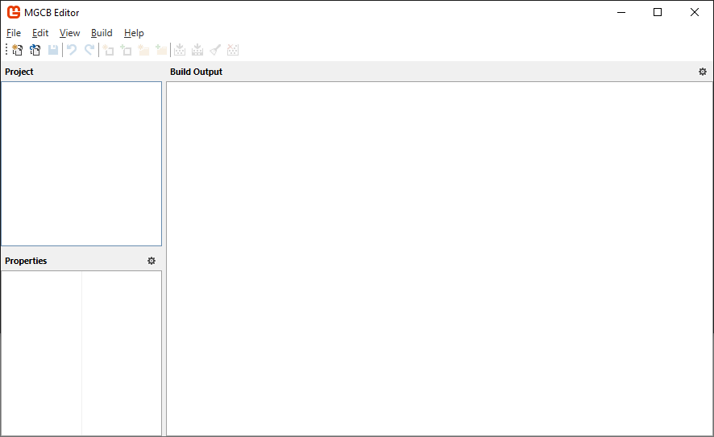

# nature-of-code-cs

Examples of _The Nature of Code Book_ writing in CS and Monogame

## Book

[THE NATURE OF CODE](https://natureofcode.com/book/)

## YouTube

[The Nature of Code: Simulating Natural Systems](https://www.youtube.com/watch?v=6vX8wT1G798&list=PLRqwX-V7Uu6aFlwukCmDf0-1-uSR7mklK)   
[The Nature of Code 2](https://www.youtube.com/watch?v=70MQ-FugwbI&list=PLRqwX-V7Uu6ZV4yEcW3uDwOgGXKUUsPOM)

## Original source code
[noc-examples-p5.js](https://github.com/nature-of-code/noc-examples-p5.js)   
[noc-examples-processing](https://github.com/nature-of-code/noc-examples-processing)

## Monogame

https://www.monogame.net   

[Visual Studio Extension](https://marketplace.visualstudio.com/items?itemName=MonoGame.MonoGame-Templates-CSharp)   

[MGCB Editor for Mac](https://www.nuget.org/packages/dotnet-mgcb-editor-mac)  
[MGCB Editor for Linux](https://www.nuget.org/packages/dotnet-mgcb-editor-linux)  
[MGCB Editor for Windows](https://www.nuget.org/packages/dotnet-mgcb-editor-windows)

--- 

## Especial thanks to *Daniel Shiffman* for this book 